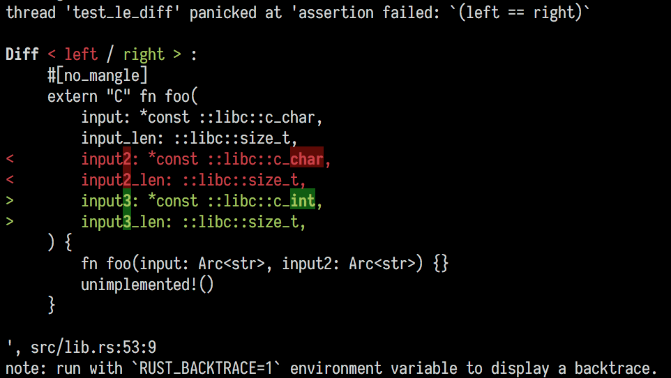

# assert_tokens_eq

Like Rust's built-in `assert_eq` macro, but for token streams.
Passes them through rustfmt,
and shows a pretty diff
(powered by [pretty_assertions]).

[pretty_assertions]: https://crates.io/crates/pretty_assertions

## How it works

You write:

```rust
let got = something_that_generates_rust_code();
let expected = quote! {
    #[no_mangle]
    extern "C" fn foo(
        input: *const ::libc::c_char,
        input_len: ::libc::size_t,
        input3: *const ::libc::c_int,
        input3_len: ::libc::size_t,
    ) {
        fn foo(input: Arc<str>, input2: Arc<str>) {}
        unimplemented!()
    }
};
assert_tokens_eq!(got, expected);
```

and you get:



## License

Licensed under either of

 * Apache License, Version 2.0, ([LICENSE-APACHE](LICENSE-APACHE) or http://www.apache.org/licenses/LICENSE-2.0)
 * MIT license ([LICENSE-MIT](LICENSE-MIT) or http://opensource.org/licenses/MIT)

at your option.

### Contribution

Unless you explicitly state otherwise, any contribution intentionally
submitted for inclusion in the work by you, as defined in the Apache-2.0
license, shall be dual licensed as above, without any additional terms or
conditions.
